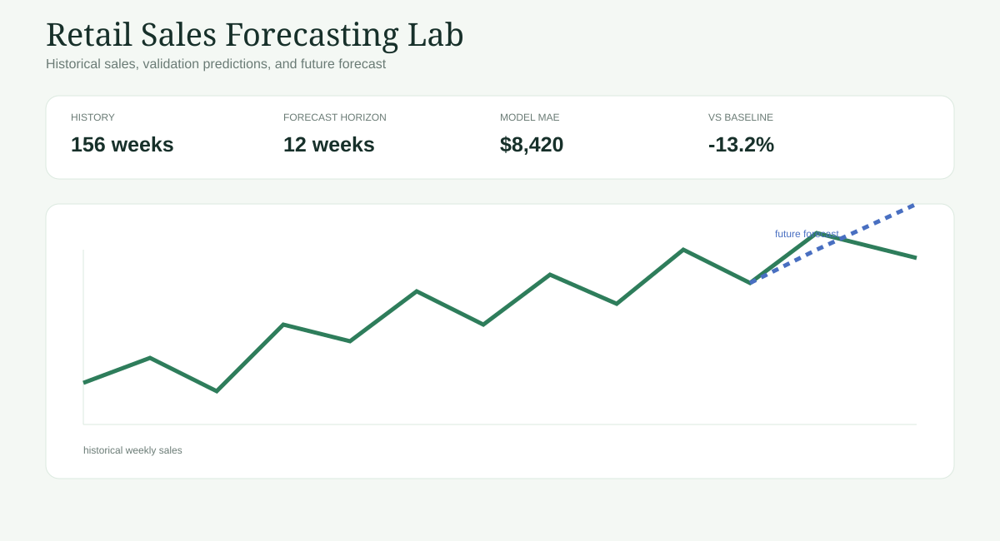

# Retail Sales Forecasting Lab

An easy-to-present, end-to-end time-series forecasting project using the popular Kaggle **Walmart Store Sales Forecasting** dataset schema. The goal is to learn historical weekly sales patterns and estimate future sales for a selected store.


## Prompt used
Build an end-to-end time series forecasting data science project using a popular Kaggle retail sales dataset.
The goal is to use historical sales data to predict future sales.
Follow the CRISP-DM framework.
Clean and explore the data, show sales trends over time, train a simple forecasting model, compare actual sales with predicted sales, and create a simple dashboard showing historical trends and future forecasts.
Include useful business insights - expected high-sales and low-sales periods.
Keep the project simple, visual, and easy to explain in a student presentation.
Include a README with the dataset, project overview, main results, screenshots, and instructions to run it locally.

help me run it locally.

## YT link
https://youtu.be/_sqVeavTcZM

## Dataset

The app accepts a Walmart-style CSV with `Store`, `Date`, `Weekly_Sales`, `Holiday_Flag`, `Temperature`, `Fuel_Price`, `CPI`, and `Unemployment`. Download the Kaggle training data and place it at `data/train.csv`.

If the CSV is not present, the app uses a deterministic fallback with trend, annual seasonality, holiday uplift, and noise so the project can be presented without a Kaggle download.

## Run locally

```bash
python3 -m venv .venv
source .venv/bin/activate
pip install -r requirements.txt
streamlit run app.py
```

Open the local URL shown by Streamlit, usually http://localhost:8501.

## Project flow

1. Load and clean weekly retail sales.
2. Explore trend, seasonality, holidays, and store differences.
3. Create calendar features: week-of-year, month, year, and trend index.
4. Fit a simple Ridge regression with lag/seasonality features.
5. Compare against a seasonal-naive baseline.
6. Forecast future weeks and surface high/low expected periods.

## Model and main results

The model is intentionally transparent: Ridge regression uses lagged sales, rolling average, trend, Fourier-like annual sine/cosine terms, and holiday flag. Evaluation uses a chronological holdout, not a random split. Reported metrics are recalculated when the app runs and are not claims about the Kaggle leaderboard. The fallback dataset is synthetic.

## Screenshot



## Architecture

- `app.py` — Streamlit dashboard
- `src/data.py` — loader, cleaning, and deterministic fallback
- `src/forecast.py` — features, baseline, Ridge model, metrics, and future forecast
- `reports/CRISP_DM_REPORT.md` — methodology and business interpretation

